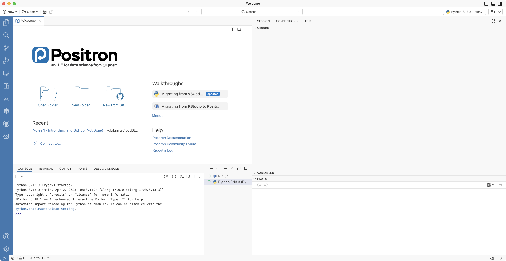
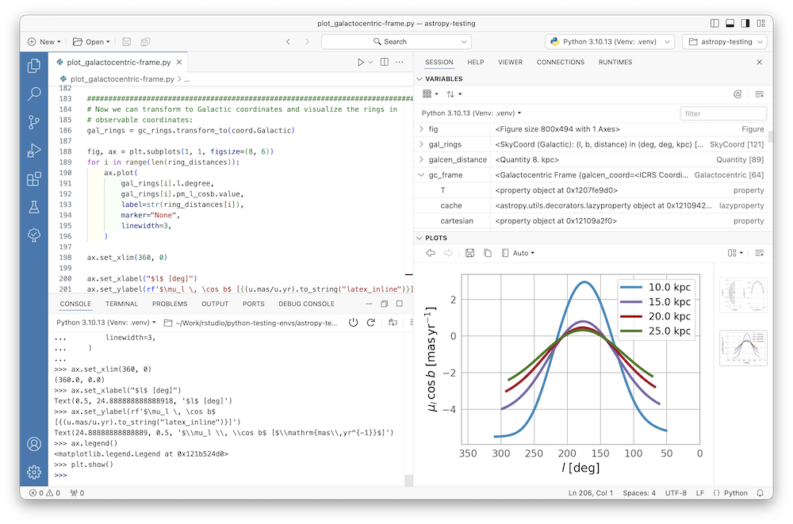
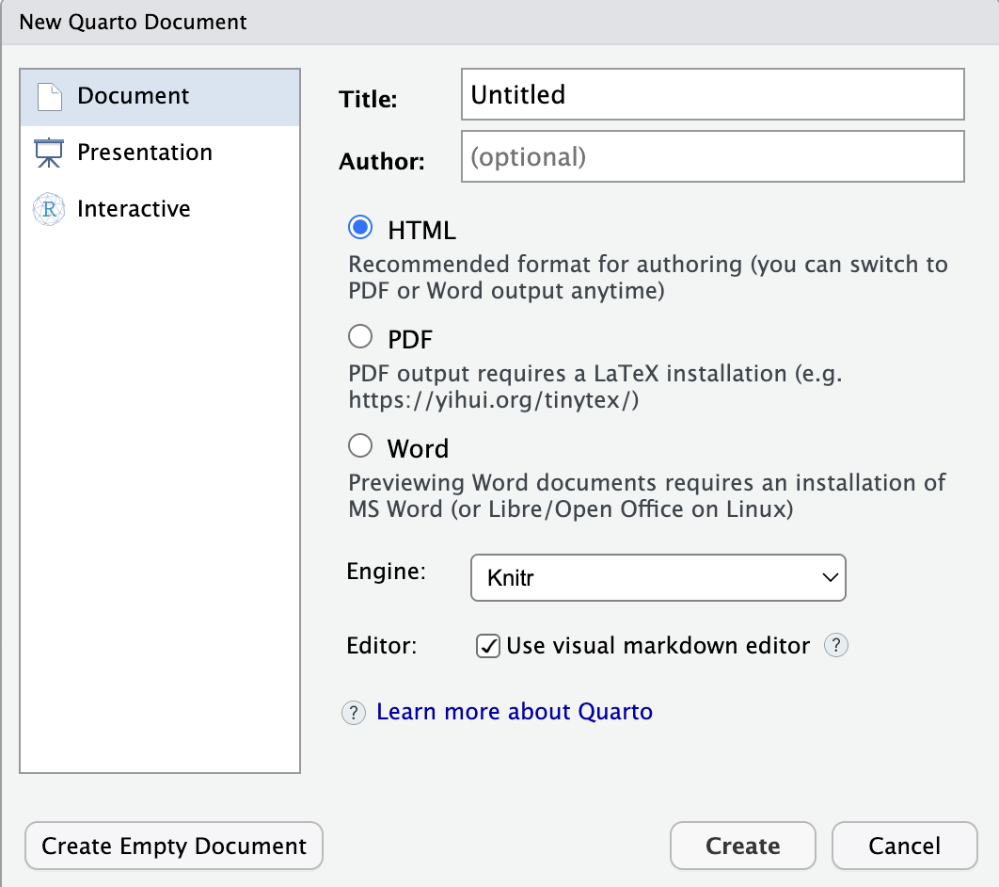
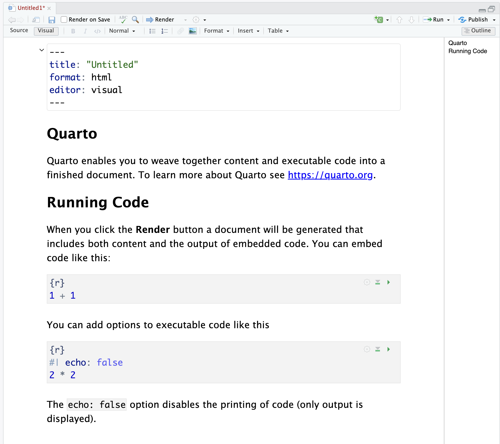
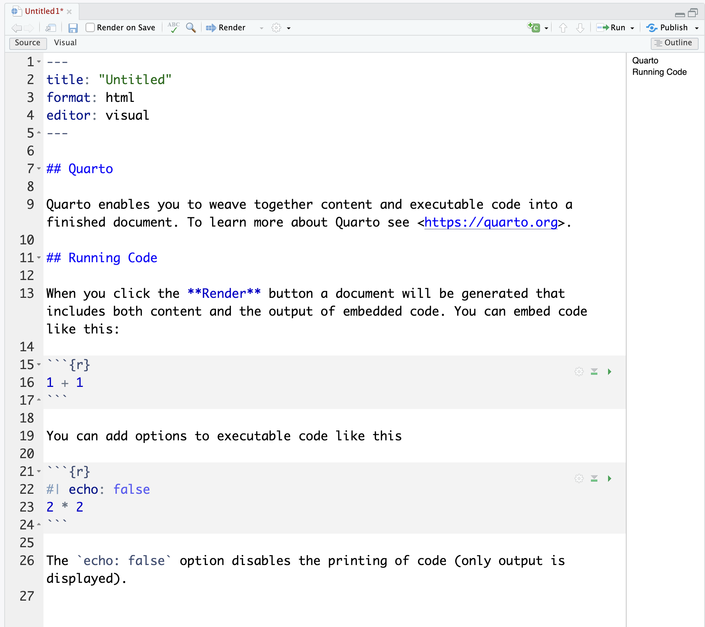

```{r}
#| label: setup
#| include: false
knitr::opts_chunk$set(echo = TRUE, fig.align="center")
```

\tableofcontents

# Installation Details

## Important installations
You will need to install the following: \vspace{.1in}

* **R** ([https://cloud.r-project.org](https://cloud.r-project.org)) or\
Python ([https://www.python.org/downloads](https://www.python.org/downloads)).
* RStudio ([https://posit.co/download/rstudio-desktop](https://posit.co/download/rstudio-desktop)) or\
Positron ([https://positron.posit.co/download.html](https://positron.posit.co/download.html)).
* GitHub Desktop Application ([https://desktop.github.com/download](https://desktop.github.com/download)).

Note: An alternative to GitHub Desktop is to use Git through the terminal. Slides for how to do this can be found on the GitHub page: [github.com/rbrown53/RRDS26](github.com/rbrown53/RRDS26), though they are not as curated for this workshop as these slides are.


## Quick Aside: Positron

Positron is a next-generation IDE (Integrated Development Environment) that is designed specifically for data science. It is like a mix between VS Code and RStudio and runs both **R** and Python (among other languages) natively. 

It is developed by Posit, which also created RStudio.

In this class, you can use RStudio or Positron. If you consider yourself primarily a Python programmer, then Positron may be a better fit for you than RStudio. However, I will give instructions is subsequety notes in RStudio, not Positron.

## Quick Aside: Positron First Impressions

{width=90%}

## Quick Aside: Positron Typical Workflow

{width=90%}

## Quick Aside: Getting Started with Positron

When you first open Positron, it will want you to update the extensions. Click on the Extensions pane on the left side (the one with 4 squares and a red number on it). Then choose to update all extensions. 

We will also need to make sure it connects to **R** (and Python if you have that installed). Click on "Start Session" in the top right. You should be able to click on the **R** version you have installed on your computer. If you have Python installed, you an easily switch back and forth between **R** and Python. 


# Quarto

## Reproducible Reports

The final product of a data analysis project is often a report: scientific publications, news articles, an analysis report for your company, or lecture notes for a class. \vspace{.1in}

Now imagine after you are done you realize you:

-   had the wrong data set
-   have a new data set for the same analysis
-   made a mistake and fix the error, or
-   your boss or someone you are training wants to see the code and be able to reproduce the results \vspace{.1in}

Situations like these are common for a data scientist.

## Quarto

Quarto is a format for **literate programming** documents. \vspace{.2in}

It is based on **markdown**, a markup language that is widely used to generate html pages. \vspace{.2in}

You can learn more about markdown here: [https://www.markdowntutorial.com/](https://www.markdowntutorial.com/)

\vspace{.2in}

Quarto is similar to environments like Jupityer Notebooks, Google Colab, and R Markdown (R Markdown is very much like Quarto, but is dependent on **R**). Quarto is language agnostic. This means it natively works in both **R** and Python (and Julia and Observable JavaScript).

Quarto comes bundled with RStudio and Positron, but you could also download Quarto here: [https://quarto.org/docs/download/](https://quarto.org/docs/download/). 


## Quarto Setup

Literate programming weaves instructions, documentation, and detailed comments in between machine executable code. \vspace{.1in}

With Quarto, you need to **compile** the document into the final report. This allows the code to run in a clean workspace each time, so it is reproduceable and gives the same results each time. \vspace{.1in}

You can start a Quarto document in RStudio or Positron by clicking on **New** (then New File... in Positron) then **Quarto Document**. In RStudio, you will then be asked for a title and author. \vspace{.1in}

Final reports can be output as to be HTML, PDF, Microsoft Word files or presentation formats like PowerPoint, Beamer, or HTML slides.

## Quarto Setup

{width=70% fig-align="center"}

## Quarto Setup

As a convention, we use the `.qmd` extension for these files.\vspace{.2in}

In the template, you will see several things to note (in the following slides).

First, the default when opening a Quarto document is that it is in **Visual** editing mode. This will likely be a little more comfortable for you if you are not used to coding in something like LaTeX. 

## Quarto Visual

{width=70% fig-align="center"}

## Quarto Source

However, we will focus on the source editor since it is much more customizable (but feel free to use the visual editor).

{width=65% fig-align="center"}

## The Header

At the top of either the visual or source editor, you will see the following:

```{r}
#| eval: false
#| echo: true
---
title: "Untitled"
format: html
editor: visual
---
```
This is known as the YAML header. YAML stands for YAML Ain't Markup Language. 

One parameter that we will highlight is `format`. By changing this to, say, `pdf` or `docx`, we can control the type of output that is produced.

## The Header

There are many, many options that can be adjusted in the YAML. 

```{r}
#| eval: false
#| echo: true
---
title: "Project Title"
author: "Your Name"
date: "1/1/2026"
format:
  html:
    code_folding: hide
    toc: true
    theme: "flatly"
editor: source # Makes the source editor the default 
               #   when file is opened. 
# Like R, you can put comments in the YAML. 
---
```

## **R** Code Chunks

In various places in the document, we see something like this:

````{verbatim}
```{r}
1 + 1
```
````

These are the code chunks. When you compile the document, the **R** code inside the chunk, in this case `1+1`, will be evaluated and the result included in that position in the final document.

To add your own **R** chunks, you can type the characters above quickly with the key binding Command-Option-I (that is a capital i) on the Mac and Ctrl-Alt-I on Windows. You can also click on the green code chunk button in the toolbar at the top.

## **R** Code Chunks

These code chunks can be used to show code, but that code will also run. Even plots can be made, although this plot is too big to fit on this slide. We will see soon how to adjust the size of plots. 
```{r}
x <- c(10, 15, 2, 4, 10, 5, 3, 5, 2)
hist(x)
```

## **R** Code Chunks

By default, both the code and the output will show up in your document. To avoid having the code show up, you can use an argument. To avoid this, you can set options for that code chunk using a special comment  `#|` in the chunk. For example:

````{verbatim}
```{r}
#| echo: false
x <- c(10, 15, 2, 4, 10, 5, 3, 5, 2)
hist(x)
```
````
These comments need to be put at the beginning of the code chunk. Notice that this is YAML, not **R** code. That is why `false` is lowercase while in **R** it would be all capitalized. 

## **R** Code Chunks

Its a good habit to add a label to the **R** code chunks. This can be useful when debugging, among other situations. You do this by using `#| label: `

````{verbatim}
```{r}
#| label: x_hist
#| echo: false
x <- c(10, 15, 2, 4, 10, 5, 3, 5, 2)
hist(x)
```
````


## Global Options and knitR

If there are certain options you want to apply to all code chunks, you can specify them in the YAML header with `execute:`. Be aware that white space matters in the YAML. The `echo` and `eval` options need to be indented, need to have a colon, and need to have one space after that colon.

````{verbatim}
---
title: "Untitled"
format: html
execute:
  echo: false
  eval: true
---
````

We use the `knitR` package to compile Quarto documents based on **R**, so we need to install that package. The specific function used to compile is the `knit()` function, which takes a filename as input. RStudio provides a Render button and Positron has a Preview button that does that for you, though.


## Adding Equations

You can add formatted equations using between dollar signs `$`. Example, if you type

```{verbatim}
$x^2+\frac{1}{2}$
```

It will look like $x^2+\frac{1}{2}$. In fact, nearly all LaTeX code works in Quarto.

If you put two dollar signs, the equation will appear on its own line. 
```{verbatim}
$$
\sum_{i=1}^{10}\left(\lambda_i+\frac{10}{\alpha}\right)
$$
```
$$
\sum_{i=1}^{10}\left(\lambda_i+\frac{10}{\alpha}\right)
$$

## Adding and Adjusting Images

We can add images to our Quarto file by using 
```{verbatim}
{width=50%}
```
if the image is already in the same directory. Otherwise, you can put the path to the file in those parentheses. We can adjust the width of the image as well by changing the number in the `width=50%`.

## Adding and Adjusting Images

If the image is generated by **R** code, we can adjust the size by using `fig-width`, `fig-height`, `out-width` and/or `out-height` options in the code chunk.

````{verbatim}
```{r}
#| label: image_code
#| eval: true
#| echo: true
#| out-width: "25%"
x <- c(10, 15, 2, 4, 10, 5, 3, 5, 2)
hist(x)
```
````

The result is shown othe next slide. 

## Adding and Adjusting Images

The first image has `out-wdith: "50%"` and\
the second has `out-wdith: "25%"`

```{r}
#| label: image_code
#| eval: true
#| echo: false
#| out-width: "50%"
x <- c(10, 15, 2, 4, 10, 5, 3, 5, 2)
hist(x)
```
```{r}
#| label: image_code2
#| eval: true
#| echo: false
#| out-width: "25%"
x <- c(10, 15, 2, 4, 10, 5, 3, 5, 2)
hist(x)
```

## Caching Code Chunks

Sometimes run chunks can take a while to run, so it makes sense to cache them. You can do that with `#| cache: true` so that the code chunk is only run once (and after each time it is edited). This will add some folders to your directory that Quarto uses to fetch needed information.

Be careful with caching! If a future code chunk that relies on the output of the cached code chunk is edited, Quarto will not re-run the cached code chunk. To make sure everything runs again, delete the folders created when caching. 

## Python in Quarto

One useful feature in Quarto is the ability to run code chunks from other languages. One of the most useful is the ability to run Python inside of Quarto. 

There are two ways to do this: 

1. Run Python natively. 
2. Run Python through **R**. 

## Run Python in Quarto Natively

If you have Python and Jupyter installed, you can put `engine: jupyter` or `engine: jupyter3` in the YAML. Then you can put Python code chunks like this:

\vspace{.2in}

````{verbatim}
```{python}
import numpy as np
np.array([[1, 2, 3], [4, 5, 6]])
```
````

Note that **R** code chunks won't work when using the `jupyter` engine unless other options are specified. 

## Run Python in Quarto through **R**

We can run Python in Quarto through **R** using the `reticulate` package. This will make it a bit slower than running Python natively. \vspace{.2in}

```{r}
#| label: reticulate
#| echo: true
#| eval: false
install.packages("reticulate")
library(reticulate)
```


## Installing Python and Python Packages Through **R**

To install Python, we can run the `install_python()` function from the `reticulate` package. Just indicate which Python version you want to install. As of the time these slides were created, the latest version is 3.14.5, but you can look up the latest version or go with the default.

```{r}
#| echo: true
#| eval: false
install_python("3.14.5") 
```

This can take a while to install. Please be patient! 

To install Python packages, we need to use an **R** code chunk using the `py_install()` function. 

```{r}
#| echo: true
#| eval: false
py_install(packages = "matplotlib")
py_install(packages = "numpy")
py_install(packages = "pandas")
```

## Running Python

Once we have installed Python, we can insert a Python code chunk just like an **R** code chunk:

````{verbatim}
```{python}
import numpy as np
import pandas as pd
x_python = np.array([1, 2, 3, 4, 5])
print(x_python)
```
````

```{python}
#| label: python_code
#| echo: false
#| eval: true
import numpy as np
import pandas as pd
x_python = np.array([1, 2, 3, 4, 5])
print(x_python)
```

## Python Envirnoment

When running Python in RStudio, the arrows in the console change and the environment switched to a Python environment. We can view what objects are stored in the **R** and Python environments by clicking on the drop down button. 

\begin{center}
\includegraphics[width=3.3in]{figs/python_env.png}
\end{center}

## Switch Between Python and **R** in RStudio

We can switch from an **R** enviornment (indicated by a single `>`) to a Python one (indicated by three arrows `>>>`) by

* Running a Python code chunk.
* Running the line `reticulate::repl_python()`.
* Double clicking on a Python object in the Python environment list.
* Clicking on the **R** icon at the top left of the Console to bring up a menu and then select Python. 

We can switch from a Python environment back to **R** by

* Running an **R** code chunk.
* Typing `exit`.
* Clicking on the Python icon at the top left of the Console to bring up a menu and then select **R**. 

## Using Python Objects in **R** and Vise-Versa

We can send objects from Python to **R** and vise-versa. Everything defined in Python is stored in the `py` object, which can be called from **R** using `py$name_of_object`. To use an **R** object in Python, we can use preface it with `r.`, so it would be `r.name_of_object`.

```{r}
#| echo: true
#| eval: true
# R Code. x_python was defined earlier.
library(reticulate)
py$x_python
y = 2 * py$x_python # Still R code
```

\vspace{.2in}

```{python}
#| echo: true
#| eval: true
# Python Code
print(r.y)
```

## Type Conversions

While many objects are stored similarly in **R** and Python, it is good to know how things are stored when they are passed back and forth. This table shows the conversion:

\begin{center}
\begin{tabular}{|c|c|c|}
\hline
{\bf R} & {\bf Python} \\
\hline
Single-element vector & Scalar\\
\hline
Multi-element vector & List\\
\hline
List of multiple types & Tuple\\
\hline
Named list & Dict\\
\hline
Matrix/Array & NumPy ndarray\\
\hline
Data Frame & Pandas DataFrame\\
\hline
Function & Python function\\
\hline
Raw & Python bytearray\\
\hline
NULL, TRUE, FALSE & None, True, False\\
\hline
\end{tabular}
\end{center}


## Differences Between Quarto and R Markdown

If you've used R Markdown, much of what we discussed in Quarto will be familiar. In fact, most R Markdown code will run in Quarto unmodified. The main differences are that Quarto does not rely on **R**, chunk options are handled with special comments: `#|` instead of in the curly brackets, and some YAML options are a little different. 

More info on differences can be found here: [https://quarto.org/docs/faq/rmarkdown.html](https://quarto.org/docs/faq/rmarkdown.html).

In **R**, you can let the `knitr` package convert chunk options from R Markdown to Quarto style using

`knitr::convert_chunk_header(input, output)`

where `input` is the path to the file you want to convert and `output` is where you want the new file to be saved.

## More on Quarto

There is a lot more you can do with Quarto. The documents that output are highly customizable You can websites (seen later), blogs, books, Shiny apps, and more. There are many free resources on the internet including:

1.  Posit's tutorial: <https://quarto.org>
2.  The Quarto guide: <https://quarto.org/docs/guide/>
3.  The Quarto definitive guide: <https://bookdown.org/yihui/rmarkdown>
5.  The knitR book: <https://yihui.name/knitr/>
6. \LaTeX\ command guide: <https://www.bu.edu/math/files/2013/08/LongTeX1.pdf>

## Extra - Tips

* Make sure you Render your document often. That way you will find any errors quickly without having to search for them. 
* Comments in **R** or Python chunks still are the familiar `#`. But comments in Quarto documents outside of **R** chunks are\
`<!-- comment here -->`.
* In RStudio, you can bulk comment by highlighting all lines you want commented and then typing `Cmd-Shift-C` on a Mac or `Ctrl-Shift-C` on Windows. 


# Git and GitHub

## Git and GitHub Introduction

Many software developers and data scientists rely on Git and GitHub everyday.

There are three main reasons to use Git and GitHub.

* \underline{Sharing:} GitHub allows us to easily share code with or without the advanced version control functionality.
* \underline{Collaborating:} Multiple people make changes to code and keep versions synced. GitHub also has a special utility, called a **pull request**, that can be used by anybody to suggest changes to your code. 
* \underline{Version control:} The version control capabilities of Git permit us to keep track of changes, revert back to previous versions, and create **branches** to test out ideas, then we can decide if we want to **merge** with the original.

<!-- See the Installation Details section for installing Git on your system. -->

<!-- ## Installing Git -->

<!-- Here is how we can install Git: -->

<!-- * If you are using a Mac, install the command line tools. You can do this by typing `"xcode-select --install"` (without the quotes) in the Terminal app. This may take a while.  -->
<!-- * Go to [https://github.com/git-guides/install-git](https://github.com/git-guides/install-git) and follow the directions for your operating system to install Git. -->

<!-- # GitHub Repositories -->

## GitHub Accounts

After installing the GitHub Desktop app, you need to create a GitHub account. To do this, go to [https://github.com](https://github.com) where you will see a link to sign up in the top right corner. \vspace{.2in}

Pick a name carefully! Choose something short, somehow related to your name, and professional. Remember that you will use this to share code with others and you might be sharing this with potential collaborators or future employers!

## GitHub Repositories

A GitHub **repository** (repo for short) is like a folder on your computer and allows you to have two copies of your code: one on your computer and one on GitHub. If you add collaborators, then each will have a copy on their computer.\vspace{.1in} 

The GitHub copy is usually considered the **main** copy (previously called the **master** and still referred to as master in many tutorials and pages). Git will help you keep all the different copies synced.

## A Note on Privacy

As of April 24, 2026, GitHub will use user data on GitHub to train its AI models by default. If this bothers you, you can opt out of this by doing the following: 

* Go to [https://github.com/settings/copilot/features](https://github.com/settings/copilot/features)
* Sign into your account
* Under Privacy, look for "Allow GitHub to use my data for AI model training"
* Change it from Enabled to Disabled

## GitHub Repositories

Now we need to initialize a repository on GitHub. You will have a page on GitHub with the URL: http://github.com/username. On your account, you can click on _Repositories_ and then click on _New_ to create a new repo:

\begin{center}
\includegraphics[width=2.2in]{figs/git_figs/github_repo.png}\quad
\includegraphics[width=2.2in]{figs/git_figs/github_repo_new.png}
\end{center}

## GitHub Repositories
Choose a good descriptive name. In Activity 2, you will create one called "RRDS26-Workshop2". You'll have the option to add a `README.md`, a `.gitignore` or choose a license when you make it, but each of those can be added later.  

You will then be able to **clone** it on your computer using the GitHub Desktop app.
\begin{center}
\includegraphics[height=1.75in]{figs/git_figs/github_desktop_clone.png}
\includegraphics[height=1.75in]{figs/git_figs/github_desktop_clone2.png}
\end{center}


## Forking
GitHub also allows you to **fork** others' repos. For example, you could go to https://github.com/rbrown53/RRDS26.
\vspace{-.03in}
\begin{center}
\includegraphics[height=2.5in]{figs/git_figs/fork_rrds.png}
\end{center}
\vspace{-.15in}
Note that this image is showing an older version of the page.

## Forking

Click _Fork_ in the top right and this will create a fork of the repository in your GitHub account. This will allow you to alter the code of other people (assuming you are allowed to do so by their license).

\begin{center}
\includegraphics[height=1.75in]{figs/git_figs/fork2.png}
\end{center}

<!-- # Git Basics -->

<!-- ## Git Setup - Tokens -->

<!-- Instead of using passwords, to connect local folders with GitHub repositories, we need to generate a GitHub **token**. Here are steps for obtaining one: -->

<!-- 1. Go to your GitHub home page: https://github.com/username -->
<!-- 2. Click on your account icon on the top right and go down to "Settings".  -->
<!-- 3. On the left side, at the bottom, click on "Developer Settings". -->
<!-- 4. On the left, click on "Personal access tokens". -->
<!-- 5. Click on Tokens (classic). We will be using the classic tokens, not the fine-grained tokens. -->
<!-- 6. Click on "Generate new token" and the "Generate new token (classic)". -->
<!-- 7. Select an expatriation time. 90 days is good.  -->
<!-- 8. Select "rep", "workflow", "gist", and "user" under scopes. -->
<!-- 9. Click on "Generate token". -->


<!-- More info can be found here: \href{https://docs.github.com/en/authentication/keeping-your-account-and-data-secure/managing-your-personal-access-tokens}{https://docs.github.com/en/authentication/keeping-your-account-and-data-secure/managing-your-personal-access-tokens} -->


<!-- ## Git Setup -->

<!-- Now we will work a bit in the Terminal. We need to let Git know who we are. This will make it clear who is making changes to files and directories. In a terminal window use the `git config` command: -->

<!-- ```{bash, eval=F} -->
<!-- git config --global user.name "My Name" -->
<!-- git config --global user.mail "my@email.com" -->
<!-- ``` -->

## Git Actions
The main actions in Git are to:

1. **pull** changes from the remote GitHub repo.
2. **add** files to the staging area, or as we say in the Git lingo: **stage** files.
3. **commit** changes to the local repository.
4. **push** changes to the **remote** GitHub repo.


## Git Setup
To effectively permit version control and collaboration in Git, files move across four different areas: 

\begin{center}
\includegraphics[width=4.5in]{figs/git_figs/git-layout.png}
\end{center}

But how does it all get started? We can clone an existing repo or initialize one. We will explore cloning first.

## Cloning Git Repositories
You can **clone** an existing **upstream repository** to your local computer. \vspace{.2in}

What does clone mean? We are going to actually copy the entire Git structure, files and directories to all stages: working directory, staging area, and local repository. 

You use the clone feature whenever you initially created a repository online on GitHub or when you fork a repository

\begin{center}
\includegraphics[width=4.5in]{figs/git_figs/git-clone.png}
\end{center}


## Working Directory

Note: the **working directory** is the folder on your computer that you will directly work with. When you edit files (e.g. in RStudio), you change the files in this directory. 

The GitHub Desktop app automatically tracks changes in the working directory.

\begin{center}
\includegraphics[width=4.5in]{figs/git_figs/git-status.png}
\end{center}


## Working Directory

For example, if I have no changes, the page for my repository would look like this image on the left. 

If I add a README.md file, I would get this notice in GitHub Desktop shown on the right:

\begin{center}
\includegraphics[height=1.6in]{figs/git_figs/github_desktop_no_change.png}
\includegraphics[height=1.6in]{figs/git_figs/github_desktop_change.png}
\end{center}


## Adding and Committing

Now lets **add** the changes to the staging area and **commit** the changes to the local Git directory. 

\begin{center}
\includegraphics[width=3.5in]{figs/git_figs/git-add.png}
\end{center}

\begin{center}
\includegraphics[width=3.5in]{figs/git_figs/git-commit.png}
\end{center}


## Adding and Committing
Adding files gets them into the staging area and ready to commit. This is done with the checkboxes by the file names, circled in red in the image on the left.

Committing saves them in the local repository as a backup. It is good practice to write a summary and give a description of the changes, as shown in the image on the right.

\begin{center}
\includegraphics[height=1.6in]{figs/git_figs/github_desktop_add.png}
\includegraphics[height=1.6in]{figs/git_figs/github_desktop_committ.png}
\end{center}

## Publish/Push

Now we can **push** the changes to the remote repo. This will upload all of your committed changes to the associated GitHub repository.

\begin{center}
\includegraphics[width=4.5in]{figs/git_figs/git-push.png}
\end{center}

## Publish/Push

The first time you want to push, GitHub desktop will ask you to Publish branch. 

After that, it will give you the option to Push origin.

\begin{center}
\includegraphics[height=1.6in]{figs/git_figs/github_desktop_publish.png}
\includegraphics[height=1.6in]{figs/git_figs/github_desktop_push.png}
\end{center}

## Fetch

We can also **fetch** any changes on the remote repo. This is different from cloning because fetching gets any changes from the GitHub repo your local folder is associated with. 

Changes can occur upstream if you make changes from a different computer, if you make changes directly on GitHub, or if someone else is also working from that repo. 

\begin{center}
\includegraphics[width=4.5in]{figs/git_figs/git-fetch.png}
\end{center}

## Fetch

On the GitHub Desktop app, there is a Fetch origin button that finds all changes and pulls them down to your local repository. 

\begin{center}
\includegraphics[width=2.5in]{figs/git_figs/github_desktop_fetch.png}
\end{center}

## Merge/Pull

And then we need to **merge** (GitHub Desktop calls this **pull**) these changes to our staging and working areas: 

\begin{center}
\includegraphics[width=4.5in]{figs/git_figs/git-merge.png}
\end{center}


We often just want to both fetch and merge with one command. That is what the **pull** command does.

\begin{center}
\includegraphics[width=4.5in]{figs/git_figs/git-pull.png}
\end{center}


## Merge/Pull

GitHub Desktop calls the merge action pull. Once changes are fetched, then can be pulled to make the working directory up-to-date. 

\begin{center}
\includegraphics[width=2.5in]{figs/git_figs/github_desktop_pull.png}
\end{center}

\underline{Important note:} it is often a good idea to fetch and pull any changes when you start each day, so as to avoid **conflicts**. 


## Creating a Git Directory

In this example, we began with a repo on GitHub, cloned it, and then did the Git actions. You can instead start with a repo on your computer first and then add a GitHub repo that is linked to it. 

In GitHub Desktop, you can click the name of the current repository on the top left, then Add, then Create new repository.... Follow the prompts. Then when you publish the repository, you can name the GitHub repo.


\begin{center}
\includegraphics[height=1.6in]{figs/git_figs/github_desktop_new.png}
\includegraphics[height=1.6in]{figs/git_figs/github_desktop_create.png}
\end{center}

## Pull Requests 

**Pull requests** enable sharing of changes from other branches/forks of a repo. Potential changes can be reviewed before they are merged into the base branch. More details on how to do these will be provided in the activity.
\begin{center}
\includegraphics[width=2.75in]{figs/git_figs/pull.png}
\end{center}

## Extra - .gitignore File

When working with Git in a local folder, a hidden folder called `.git` is created. Another hidden file that is useful is `.gitignore`, which lets Git know what files it should NOT keep track of. We can add this when creating a repo on GitHub or we can add this on the local machine by navigating to the directory and creating a text file with the name `.gitignore`. 

## Extra - Hidden Files

These file and folders that begin with a period (.) are hidden by default, but sometime we want to edit them, especially the `.gitignore`. We can see hidden files by doing the following:

Mac: In Finder, type `Shift-Command-.` (period). Type that again to hide the files again.

Windows 10: \vspace{-.1in}

1. Open File Explorer from the taskbar. 
2. Select View > Options > Change folder and search options.
3. Select the View tab and, in Advanced settings, select Show hidden files, folders, and drives and OK.

Windows 11: \vspace{-.1in}

1. Open File Explorer from the taskbar. 
2. Select View > Show > Hidden items.

<!-- ## Conclusion -->

<!-- Positron also has a more visual version control that uses Git built in. It is on the left side and its symbol looks like a branching path.  -->

<!-- On Canvas, you'll find a file called "Unix and Git Cheat Sheet.pdf" that contains all of the Git and Unix commands that are contained in these notes plus more. -->


# Quarto Websites

## Quarto Websites

Another powerful feature of Quarto is the ability to create a website to publish different html pages that were, in turn, created in Quarto. 

These websites can be hosted on personal servers, on Posit servers, or for free through GitHub pages.

Activity 3 gives step-by-step instructions for how create a Quarto website and to host it on GitHub. 

More information about Quarto websites can be found here: [https://quarto.org/docs/websites](https://quarto.org/docs/websites).

## Acknowledgements

These slides were adapted from slides created by W. Evan Johnson and some of the Git images are from [_Introduction to Data Science: Data Analysis and Prediction Algorithms with R_](https://rafalab.dfci.harvard.edu/dsbook) by Rafael A. Irizarry.

## Session Info
\tiny
```{r}
#| label: session_info
#| echo: true
#| eval: true
sessionInfo()
```
\vspace{.1in}


